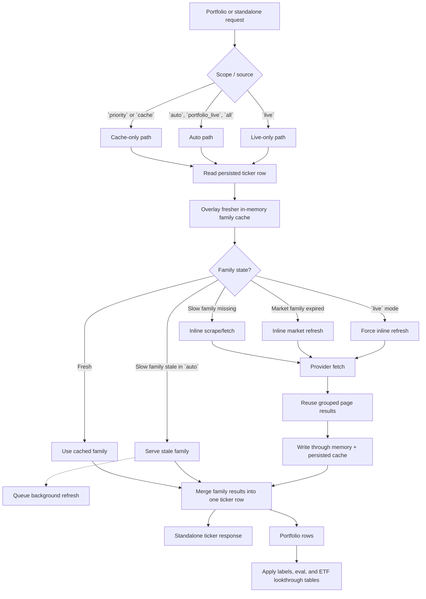
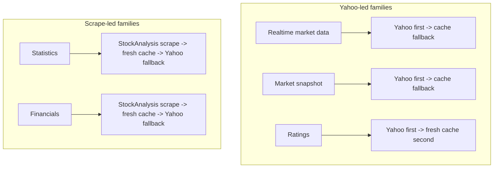

# Stock News / Stock Search

**Static Demo**: https://teron131.github.io/stock-search

A single-user stock analysis app that prioritizes free data, resilient fallbacks, and simple storage.

## Core Methodology

- **Separation of concerns**: Portfolio management, ticker-level stat resolution, and evaluation logic are isolated so each layer can evolve independently.
- **Source-first indicators**: Data source adapters (`yfinance`, StockAnalysis) are treated as causes; indicator orchestration is the effect layer that unifies fields and fills gaps.
- **Cache-aware by design**: Missing fields resolve to `None` or cached values when freshness rules allow, reducing noisy failures and unnecessary refetches.
- **Batch over piecemeal**: When a provider call naturally returns grouped data, the app consumes it as a batch to reduce duplicate requests.

## Stats Resolution Flow





## Module Overview

- **`stock_search/data_sources/`**
  - Provider-specific fetchers and parsers.
  - Keeps external API/scraping variability out of business logic.

- **`stock_search/indicators.py`**
  - Unified indicator resolver across sources.
  - Centralizes field-level precedence and cache fallback so callers stay source-agnostic.

- **`stock_search/evaluation/`**
  - Scoring, normalization, and ranking logic.
  - Keeps decision logic deterministic and independent from raw fetching.

- **`stock_search/api/`**
  - HTTP routes for portfolio flows, standalone ticker reads, and utility endpoints.
  - Clean boundary between UI contract and internal data orchestration.

- **`stock_search/models/`**
  - Shared schemas, labels/constants, and storage interfaces.
  - One canonical model layer for API, evaluation, and persistence code.

- **`stock_search/models/convex/`**
  - Convex adapter, store facade, and import tooling.
  - Encapsulates cloud persistence details behind typed, app-level operations.

## Data Sources

- **Yahoo Finance (`yfinance`)**
  - Fast quote/history/options/ratings-oriented data access.
  - Broad free coverage and strong baseline for live market fields.

- **StockAnalysis (web extraction)**
  - Statistics/financial statement aligned fields and ETF holdings context.
  - Better alignment for valuation/fundamental fields where API feeds can diverge.

- **Fallback policy**
  - Prefer higher-quality source per field group, then cache, then fallback provider.
  - Improves consistency while remaining resilient during source failures.

## Convex

- Primary persistence backend for stocks, portfolio state, news, and metadata.
- Gives a single cloud-backed source of truth and supports realtime-friendly integration.

Current Convex function namespaces are intentionally singular to match the one-portfolio app model:

- `portfolio:get`, `portfolio:set`
- `stock:list`, `stock:get`, `stock:replaceAll`
- `news:list`, `news:replaceAll`
- `meta_versions:get`, `meta_versions:set`

## Local SQLite

- Local fallback and non-Convex mode now use `data/stock_search.db`.
- `generate_static_data.py` writes sample data to `data/sample_stock_search.db` by default and can refresh the main SQLite store with `--prod`.

## FastMCP

A minimal FastMCP proxy server is available for the existing FastAPI backend. It converts the main backend endpoints into MCP tools without duplicating business logic.

Run it with:

```bash
uv run python -m stock_search.mcp
```

The MCP server currently exposes tools for:

- portfolio reads and position updates
- standalone stock stats
- stored eval and stock maps
- realtime config, stock news, and ticker evaluation

## CLI

The same MCP-backed tool set is also available as a local CLI.

Run it with:

```bash
uv run stock-search list-tools
uv run stock-search get-portfolio --scope priority
uv run stock-search get-stock-stats NVDA --source cache
uv run stock-search evaluate-stock NVDA
```

The CLI discovers the MCP tools at runtime and maps them to kebab-case subcommands, so it stays aligned with the MCP surface.
