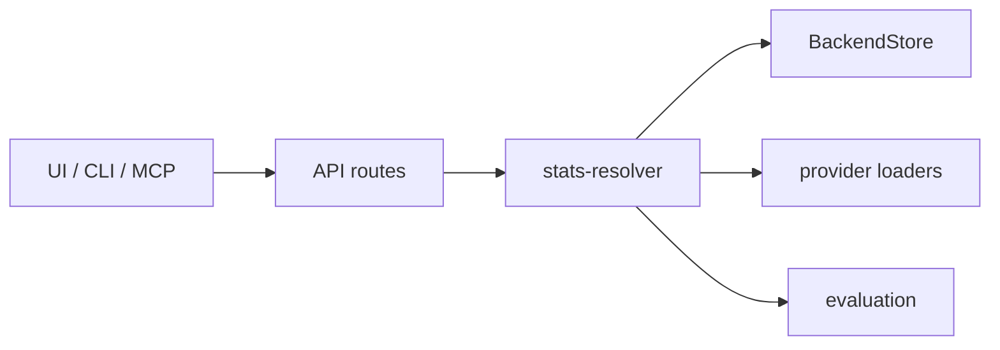
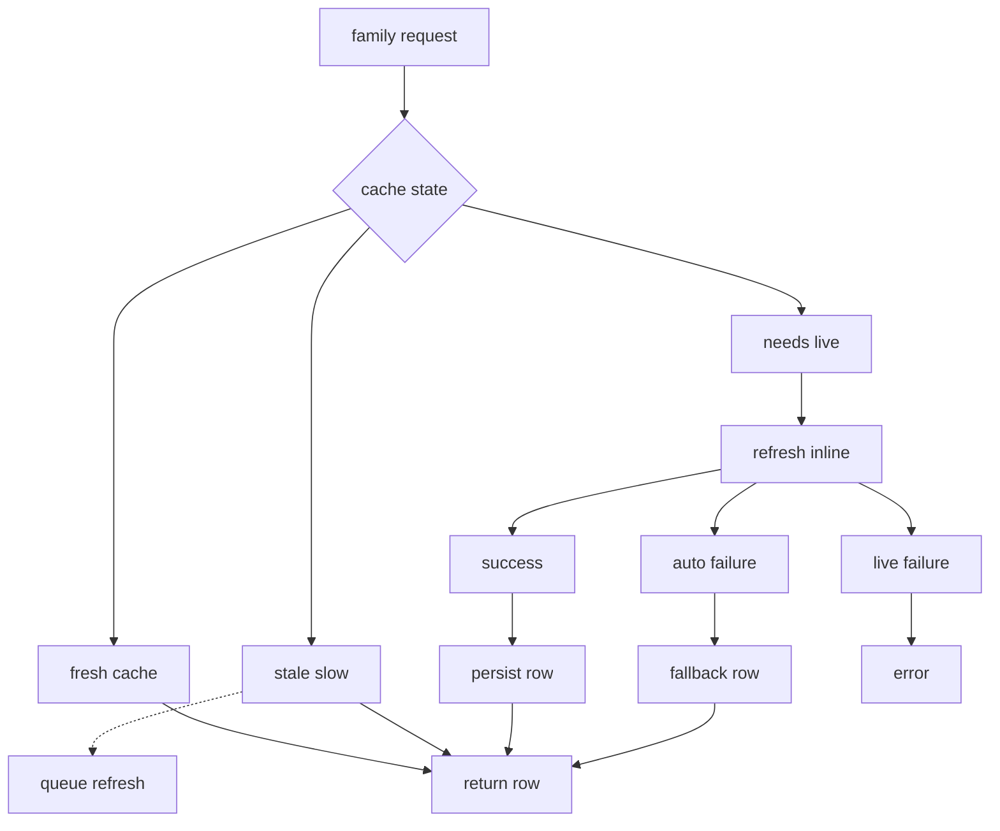
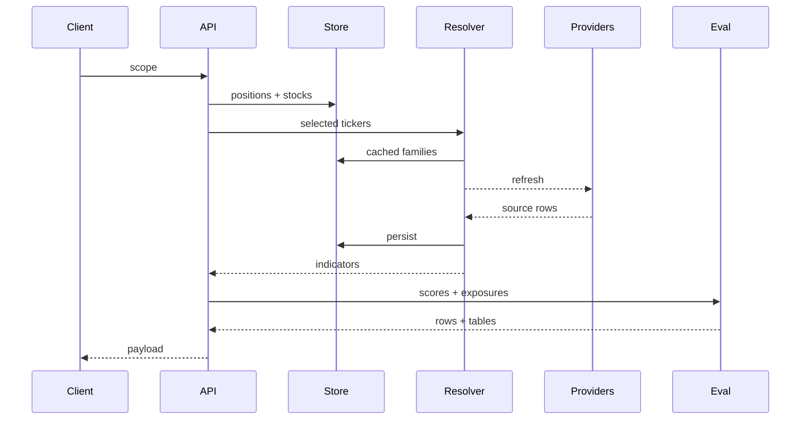

# Stock News / Stock Search

**Static Demo**: https://teron131.github.io/stock-search

The GitHub Pages demo is bundled from `ui/public/demo/` and uses a seeded random-share portfolio snapshot so the README link stays self-contained.

A single-user stock analysis app that prioritizes free data, resilient fallbacks, and simple storage.

## Runtime

Run the full app with:

```bash
pnpm install
pnpm run dev
```

Run the backend only with:

```bash
pnpm run server:start
```

## Core Data Contract

The app keeps three ideas separate:

- **Portfolio state** is the user's positions and strategies.
- **Stock indicators** are cacheable market data, metadata, fundamentals, ratings, and ETF lookthrough fields.
- **Evaluation** is derived from indicators, plus any stored research placeholders.

Most reads are therefore cache-first at the storage boundary, but source-aware inside each stat family. A request chooses a freshness policy; the resolver decides which families need live work; provider-specific fetchers fill only the fields they own.

## Request Modes

Portfolio routes use `scope`; standalone ticker routes, CLI `stocks`, and MCP `get_stock_stats` use `source`.

| Surface | Knob | Values | Contract |
| --- | --- | --- | --- |
| Portfolio | `scope` | `priority` | Default dashboard path. Refreshes the tickers that matter for the prioritized view. |
| Portfolio | `scope` | `all_cached` | Cache-only all-universe view. Loads every stored stock without live refresh, and lets the browser reuse the response briefly. |
| Portfolio | `scope` | `portfolio_live` | Refreshes held portfolio rows and stores portfolio stats. |
| Portfolio | `scope` | `all` | Broad live-capable all-universe view. |
| Ticker / CLI / MCP | `source` | `auto` | Use fresh cache, serve usable stale slow families while queueing refresh, and refresh inline when required. |
| Ticker / CLI / MCP | `source` | `live` | Force inline provider refresh; fail instead of silently falling back when live data is unavailable. |
| Ticker / CLI / MCP | `source` | `cache` | Read the stored row only. |

For external portfolio reads, prefer MCP `get_portfolio` with no `scope` or REST `/portfolio?scope=portfolio_live`. The stored `/portfolio/stats` payload is a cache snapshot and can be stale.

With `DATA_STORE_BACKEND=d1`, reads and writes go directly to Cloudflare D1. Local SQLite is used only when `DATA_STORE_BACKEND=sqlite`.

## Runtime Shape



The important boundary is `stats-resolver`: clients describe freshness intent, the resolver enforces cache policy by family, provider loaders fill canonical fields, and evaluation consumes the merged indicator row.

## Stats Resolution

Stats are grouped into freshness families so fast market data can refresh aggressively without making slower fundamentals noisy or expensive.

| Family | Main fields | Fresh | Stale allowed | Live owner |
| --- | --- | --- | --- | --- |
| `market_data` | price, day change | 1 minute | 10 minutes | Yahoo |
| `market_snapshot` | name, type, sector, industry, momentum | 1 hour | 2 days | Yahoo metadata plus cache |
| `statistics` | multiples, market cap, PEG, beta, balance sheet | 1 day | 2 days | StockAnalysis and Finviz blend |
| `financials` | growth, margins, FCF, R&D | 1 day | 2 days | StockAnalysis and Finviz blend |
| `ratings` | analyst median upside and rating rows | 1 day | 2 days | Yahoo |



## Provider Priority

Provider precedence is field-aware, not source-wide:

- **Yahoo** owns fast market fields, option/ratings-oriented fields, and stock metadata labels (`name`, `quote_type`, `sector_name`, `industry_name`).
- **StockAnalysis** owns fundamental statistics and financials when its public pages expose period-aligned values.
- **Finviz** fills slow statistic gaps and can provide sector/industry labels as fallback. Its sector label `Financial` is normalized to `Financial Services`; industry labels keep the `" - "` separator.
- **Cache** is a real tier, not a last-minute accident. If live refresh fails in `auto`, stale or persisted fields are used when they are known and meaningful.
- **Yahoo fallback for sensitive fundamentals is limited.** Fundamental fields such as valuation and growth should prefer public web-source values; missing low-confidence values should stay missing rather than poisoning scores.

| Family | Primary path | Cache and fallback behavior |
| --- | --- | --- |
| `market_data` | Yahoo quote/history indicators | Cache only in `cache` mode or after allowed auto fallback. Stale market data blocks inline in `auto`. |
| `market_snapshot` | Yahoo metadata and indicators | Persisted labels and metadata are reused when fresh enough; fallback labels can come from Finviz. |
| `statistics` | StockAnalysis plus Finviz field merge | Cache can fill known fields; Yahoo is a limited final fallback for compatible scalar fields. |
| `financials` | StockAnalysis plus Finviz field merge | Cache can fill known fields; low-confidence Yahoo growth values are not forced into period-aligned fields. |
| `ratings` | Yahoo ratings and analyst fields | Cache protects the dashboard when ratings endpoints are unavailable. |

## News Workflow

News is split into a fast provider path and optional LLM stages.

- **`raw-fast`** is the default ticker mode for UI, CLI, MCP, and `/stock/:ticker/news`. It fans out to configured news providers, always includes Yahoo Finance news, can fill shortfalls with Exa, dedupes and ranks by ticker/company identity, filters stale or unusable stories, and attaches bounded webloaded excerpts.
- **`analyzed-slow`** uses the same source path, then runs LLM analysis for ticker-specific relevance, category, sentiment, and summary fields. If model analysis is unavailable, provider labels are used as fallback.
- **Portfolio news** is stored separately from ticker fetches. Raw portfolio bundles can be built for held tickers, while `/portfolio/news`, `/portfolio/news/summary`, and `/portfolio/news/summarize` load, persist, or generate shared portfolio-level news payloads.

## Portfolio Workflow

Portfolio payloads start from positions, then attach stock rows, labels, live stats, ETF lookthrough, and deterministic scores. ETFs are treated as wrappers unless holdings-proxy stats are available.



## Evaluation Anchors

Scores are deterministic and recomputed from current indicators. Valuation is intentionally sector-relative; the other lanes stay mostly absolute.

| Score lane | Anchor policy |
| --- | --- |
| `valuation_score` | Directly sector-relative through valuation anchors selected from `sector_name`. |
| `quality_score` | Uses global dynamic anchors, not sector anchors. |
| `moat_score` | Uses mostly absolute/global rules, not sector anchors. |
| `upside_score` | Uses its own inputs, with valuation influencing support/caps indirectly. |
| `tactical_score` | Includes valuation as one component, so sector anchoring enters indirectly. |
| `overall_score` | Blends derived lanes, so sector anchoring enters only through valuation-weighted parts. |

## Module Overview

- **`src/stock-search/data-sources/`**
  - Provider-specific loaders and normalizers.
  - Keeps external provider variability out of business logic.

- **`src/stock-search/indicators.ts`**
  - Compatibility wrapper over provider adapters and the source-merge policy.
  - Useful for one-shot live indicator fetches and source-level smoke checks.

- **`src/stock-search/stats-resolver/`**
  - Family-based cache, freshness, provider-bundle, source-merge, and monetary normalization logic.
  - This is the main path for portfolio, standalone ticker, CLI, and MCP stats reads.

- **`src/stock-search/news/`**
  - Ticker and portfolio news pipeline, provider fan-out, source selection, optional LLM analysis, and portfolio summary persistence.
  - Keeps news coordination out of API routes and UI data hooks.

- **`src/stock-search/ticker.ts`**
  - Shared standalone ticker payload builder used by HTTP routes and MCP tools.
  - Keeps ticker response assembly independent from transport-specific routing.

- **`src/stock-search/evaluation/`**
  - Scoring, normalization, and ranking logic.
  - Keeps decision logic deterministic and independent from raw fetching.

- **`src/stock-search/storage/`**
  - Backend persistence contract, store factory, D1 adapter, and local SQLite implementation.
  - Keeps API, MCP, portfolio, resolver, and scripts behind one storage boundary.

- **`src/stock-search/api/`**
  - HTTP routes for portfolio flows, standalone ticker reads, and utility endpoints.
  - Clean boundary between UI contract and internal data orchestration.

- **`src/stock-search/models/`**
  - Shared schemas, labels/constants, and provider-facing model helpers.
  - One canonical model layer for API, evaluation, and provider/persistence adapters.

- **`src/stock-search/policy.ts`**
  - Central `policy` facade for request workflows and stats-family refresh decisions.
  - Keeps implementation classes in `src/stock-search/policies/`, with callers using `policy.request` and `policy.stats`.
  - Keeps workflow decisions separate from runtime config, fetching, merging, and persistence code.

## Data Sources

- **Yahoo Finance**
  - Fast quote/history/options/ratings-oriented data access.
  - Broad free coverage and strong baseline for live market fields.

- **StockAnalysis (Exa-loaded page contents)**
  - Statistics/financial statement aligned fields and ETF holdings context.
  - Better alignment for valuation/fundamental fields where API feeds can diverge.

- **Finviz**
  - Slow quote-page statistics fallback for valuation and growth fields.
  - Also supplies sector/industry labels when Yahoo metadata is missing.

- **NewsData, Massive, NewsAPI, Exa, and Yahoo Finance news**
  - News provider fan-out for ticker and portfolio news workflows.
  - API-backed providers are used when their env vars are configured; Yahoo remains the baseline public source.

- **Fallback policy**
  - Prefer higher-quality source per field group, then cache, then fallback provider.
  - Improves consistency while remaining resilient during source failures.

## Storage

`BackendStore` hides persistence behind one app-level interface. Local mode uses SQLite directly at `data/stock_search.db`. Cloud mode uses Cloudflare D1 through the D1 REST API.

Configure D1 with:

```bash
DATA_STORE_BACKEND=d1
D1_ACCOUNT_ID=...
D1_DATABASE_ID=...
D1_API_TOKEN=...
```

The app creates the current D1 tables idempotently at startup.

The same store also owns evaluation calibration rows in `calibration_stats`, so D1 and local SQLite use the same tables for scoring anchors.

## FastMCP

A FastMCP server is available for the TypeScript backend. It exposes the same app surface as MCP tools without duplicating business logic.

Run it with:

```bash
pnpm run mcp:start
```

The MCP server currently exposes tools for:

- portfolio reads and position updates
- standalone stock stats
- stored eval and stock maps
- raw-fast and analyzed-slow stock news, portfolio news bundles, persisted portfolio news summaries, and ticker evaluation

## CLI

The local CLI exposes only the useful human-facing endpoints. `stocks` returns compact scalar stock stats and accepts either one ticker or many tickers.

Run it with:

```bash
pnpm run cli help
pnpm run cli stocks NVDA
pnpm run cli stocks NVDA MSFT
pnpm run cli stocks NVDA,MSFT --source live
pnpm run cli sectors
pnpm run cli news NVDA --mode raw-fast --max-results 8
pnpm run cli news NVDA --mode analyzed-slow --pretty
pnpm run cli evaluate NVDA
```

JSON output is compact by default; pass `--pretty` for indented output.
For machine parsing through pnpm, use `pnpm --silent run cli ...` so stdout contains only command output.
